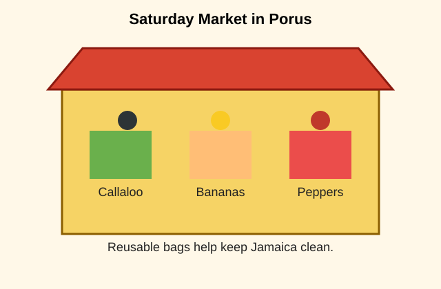

# Porus Primary School
## Grade 6 Language Arts Quiz

Time: 20 minutes
Total Marks: 15

Instructions:
- Read each item carefully.
- Choose the best answer from A, B, C, or D.
- Write only the letter of your answer.

---

Look at the picture and read the passage. Then answer Questions 1 to 5.

On Saturday morning, Keisha helped her grandmother at the market in Porus. The stall was filled with callaloo, tomatoes, ripe bananas, and Scotch bonnet peppers. Keisha noticed that some customers brought reusable bags instead of plastic bags. Her grandmother smiled and said, "Small choices can help to keep Jamaica clean." By midday, Keisha had learned how to count change, greet customers politely, and pack the vegetables carefully.

1. Where did Keisha go on Saturday morning?

A. To school
B. To the market
C. To church
D. To the beach

2. Which word best describes Keisha's grandmother?

A. Helpful
B. Careless
C. Angry
D. Lazy

3. What lesson did Keisha's grandmother teach her?

A. Markets should close early.
B. Vegetables are hard to grow.
C. Small choices can help the environment.
D. Customers should never use bags.

4. In the passage, the word "politely" means acting in a way that is

A. rude.
B. respectful.
C. noisy.
D. hurried.

5. Which activity did Keisha learn at the market?

A. Painting signs
B. Counting change
C. Driving a taxi
D. Cooking soup

Use the table below to answer Question 6.

| Word | Part of Speech |
|---|---|
| quickly | adverb |
| teacher | noun |
| beautiful | adjective |
| jump | verb |

6. Which word in the table names a person?

A. quickly
B. teacher
C. beautiful
D. jump

7. Which sentence uses correct subject-verb agreement?

A. The boys runs quickly.
B. The boy run quickly.
C. The boys run quickly.
D. The boys running quickly.

8. Choose the correctly punctuated sentence.

A. We visited Kingston Montego Bay and Mandeville.
B. We visited Kingston, Montego Bay, and Mandeville.
C. We visited Kingston Montego Bay, and Mandeville.
D. We visited, Kingston, Montego Bay and Mandeville.

9. Which word is the antonym of "generous"?

A. kind
B. giving
C. selfish
D. cheerful

10. Which sentence is written in the past tense?

A. I walk to school.
B. I am walking to school.
C. I walked to school.
D. I will walk to school.

11. Which word correctly completes the sentence?

Maria and I ___ going to the library.

A. is
B. am
C. are
D. was

12. Which sentence contains a simile?

A. The sun rose over the hill.
B. The boy ran like lightning.
C. The book was on the desk.
D. The rain fell all afternoon.

13. Which prefix can be added to "happy" to mean not happy?

A. re-
B. un-
C. pre-
D. mis-

14. Which sentence is a complete sentence?

A. After the bell rang.
B. The students in the classroom.
C. Running quickly to the gate.
D. The students packed their bags.

15. Which word should begin with a capital letter?

A. mango
B. river
C. jamaica
D. school

---

## Answer Key

1. B
2. A
3. C
4. B
5. B
6. B
7. C
8. B
9. C
10. C
11. C
12. B
13. B
14. D
15. C
