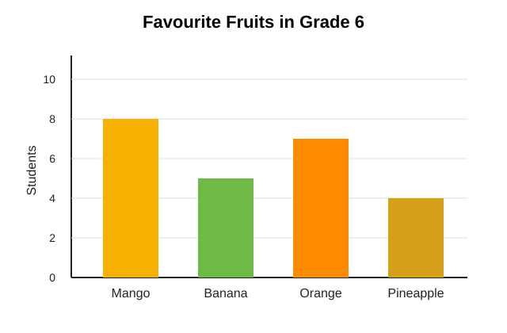

# Porus Primary School
## Grade 6 Mathematics Quiz

Time: 20 minutes
Total Marks: 15

Instructions:
- Read each question carefully.
- Choose the best answer from A, B, C, or D.
- Write only the letter of your answer.

---

1. What is the value of 7,508 + 2,397?

A. 9,805
B. 9,905
C. 10,905
D. 8,905

2. A farmer in Clarendon harvested 36 mangoes. He packed them equally into 6 bags. How many mangoes were in each bag?

A. 5
B. 6
C. 7
D. 8

3. Which fraction is equivalent to 3/4?

A. 6/12
B. 9/12
C. 4/8
D. 12/18

4. What is 0.6 written as a fraction in simplest form?

A. 3/5
B. 6/100
C. 1/6
D. 5/3

5. A pencil costs $45. How much will 4 pencils cost?

A. $90
B. $135
C. $180
D. $225

6. Which number is 25% of 80?

A. 10
B. 20
C. 25
D. 40

7. A class begins at 8:30 a.m. and ends at 10:00 a.m. How long is the class?

A. 30 minutes
B. 1 hour
C. 1 hour 30 minutes
D. 2 hours

8. The perimeter of a rectangle is 30 cm. Its length is 10 cm. What is its width?

A. 5 cm
B. 10 cm
C. 15 cm
D. 20 cm

9. Which shape has exactly 3 sides?

A. Square
B. Triangle
C. Pentagon
D. Hexagon

10. What is the next number in the pattern? 4, 8, 12, 16, ___

A. 18
B. 20
C. 22
D. 24

11. If n + 9 = 17, what is the value of n?

A. 6
B. 7
C. 8
D. 9

Use the bar chart and table below to answer Questions 12 and 13.

| Fruit | Number of Students |
|---|---:|
| Mango | 8 |
| Banana | 5 |
| Orange | 7 |
| Pineapple | 4 |

12. Which fruit was chosen by the greatest number of students?

A. Mango
B. Banana
C. Orange
D. Pineapple

13. How many more students chose mango than pineapple?

A. 2
B. 3
C. 4
D. 5

14. A bus has 48 passengers. At a stop, 15 passengers get off and 9 get on. How many passengers are now on the bus?

A. 24
B. 33
C. 42
D. 54

15. A spinner has 4 equal sections: red, blue, green, and yellow. What is the probability of landing on blue?

A. 1/2
B. 1/3
C. 1/4
D. 1/5

---

## Answer Key

1. B
2. B
3. B
4. A
5. C
6. B
7. C
8. A
9. B
10. B
11. C
12. A
13. C
14. C
15. C
