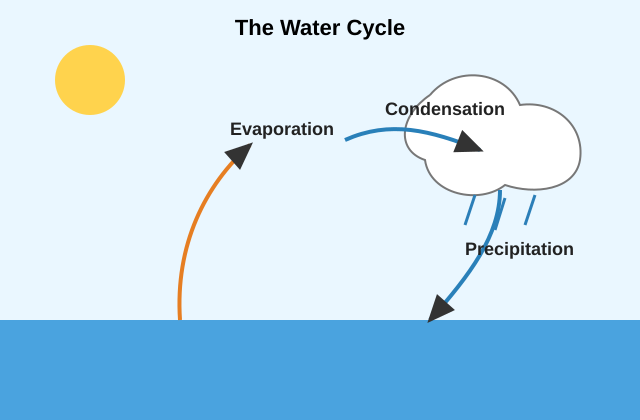

# Porus Primary School
## Grade 6 Science Quiz

Time: 20 minutes
Total Marks: 15

Instructions:
- Read each question carefully.
- Choose the best answer from A, B, C, or D.
- Write only the letter of your answer.

---

1. Which part of a plant mainly absorbs water from the soil?

A. Flower
B. Leaf
C. Root
D. Fruit

2. In a food chain, green plants are called producers because they

A. eat small animals.
B. make their own food.
C. break down dead matter.
D. hunt for food at night.

3. Which of the following is a consumer?

A. Grass
B. Mango tree
C. Goat
D. Fern

4. Which human body system is mainly responsible for carrying blood around the body?

A. Digestive system
B. Circulatory system
C. Skeletal system
D. Respiratory system

5. Which habit best helps to prevent the spread of germs?

A. Sharing a water bottle
B. Washing hands with soap
C. Leaving food uncovered
D. Coughing without covering the mouth

Use the table below to answer Questions 6 and 7.

| Material | Observation in Water |
|---|---|
| Salt | Disappeared after stirring |
| Sand | Settled at the bottom |
| Stone | Sank to the bottom |
| Plastic cap | Floated on top |

6. Which material dissolved in water?

A. Sand
B. Stone
C. Salt
D. Plastic cap

7. Which material floated on top of the water?

A. Salt
B. Sand
C. Stone
D. Plastic cap

8. Which state of matter has a fixed shape and a fixed volume?

A. Solid
B. Liquid
C. Gas
D. Vapour

9. What form of energy is mainly produced by a lit bulb?

A. Sound energy
B. Light energy
C. Magnetic energy
D. Chemical energy

10. Which force pulls objects towards the Earth?

A. Friction
B. Gravity
C. Magnetism
D. Electricity

Look at the water cycle diagram. Then answer Questions 11 and 12.

11. Which process changes water vapour into liquid water?

A. Melting
B. Freezing
C. Condensation
D. Evaporation

12. Which process is shown when water falls from clouds as rain?

A. Precipitation
B. Evaporation
C. Melting
D. Freezing

13. During a hurricane, which action is safest?

A. Stand under a tree
B. Go outside to watch the wind
C. Stay indoors away from windows
D. Play near flooded drains

14. In a fair test, what should be changed on purpose?

A. The controlled variable
B. The independent variable
C. All variables
D. No variables

15. Why should people avoid dumping garbage in gullies and rivers?

A. It makes the water colder.
B. It can cause pollution and flooding.
C. It makes fish grow faster.
D. It increases rainfall.

---

## Answer Key

1. C
2. B
3. C
4. B
5. B
6. C
7. D
8. A
9. B
10. B
11. C
12. A
13. C
14. B
15. B
