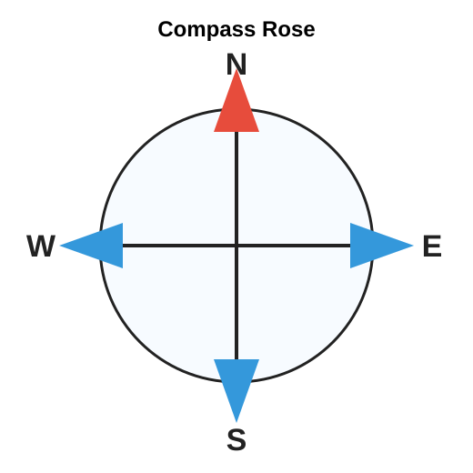

# Porus Primary School
## Grade 6 Social Studies Quiz

Time: 20 minutes
Total Marks: 15

Instructions:
- Read each question carefully.
- Choose the best answer from A, B, C, or D.
- Write only the letter of your answer.

---

1. Which city is the capital of Jamaica?

A. Montego Bay
B. Mandeville
C. Kingston
D. Port Antonio

2. Which of the following is a national symbol of Jamaica?

A. Doctor bird
B. Lion
C. Coconut crab
D. Maple leaf

3. What do the black, green, and gold colours of the Jamaican flag represent?

A. Hardships, land, and sunshine
B. Rivers, mountains, and food
C. Music, sports, and festivals
D. Cities, roads, and buildings

4. Which National Hero is known for leading enslaved Africans in the fight for freedom and was associated with the Morant Bay Rebellion?

A. Paul Bogle
B. Marcus Garvey
C. Norman Manley
D. Alexander Bustamante

Use the table below to answer Questions 5 and 6.

| Level of Government | Example of Responsibility |
|---|---|
| National government | Makes laws for the country |
| Local government | Helps manage parish services |
| School council | Supports school activities |

5. Which group is mainly responsible for making laws for Jamaica?

A. National government
B. School council
C. Police station
D. Parish library

6. Which group helps manage parish services?

A. Local government
B. A football club
C. A supermarket
D. A tourist hotel

7. A responsible citizen should

A. ignore community rules.
B. throw garbage in drains.
C. respect the rights of others.
D. damage public property.

8. Which Caribbean country is closest to Jamaica?

A. Barbados
B. Cuba
C. Trinidad and Tobago
D. Guyana

9. Why is tourism important to Jamaica?

A. It causes all farms to close.
B. It provides jobs and earns income.
C. It stops people from travelling.
D. It prevents trade with other countries.

10. Which physical feature is found in Jamaica?

A. Blue Mountains
B. Sahara Desert
C. Amazon River
D. Rocky Mountains

Look at the compass rose. Then answer Questions 11 and 12.

11. Which direction is opposite north?

A. East
B. West
C. South
D. North-east

12. On a map, a symbol is used to

A. make the map heavier.
B. show information such as roads, rivers, or buildings.
C. hide important places.
D. replace the map title.

13. Which activity is an example of agriculture?

A. Growing yam
B. Repairing a computer
C. Driving a tourist bus
D. Selling insurance

14. Before a hurricane, a family should

A. prepare an emergency kit.
B. leave windows open.
C. go swimming in the sea.
D. ignore weather reports.

15. Which statement best shows regional cooperation in the Caribbean?

A. Countries refusing to speak to each other
B. Caribbean countries working together through CARICOM
C. Each island closing all schools permanently
D. People avoiding trade with neighbours

---

## Answer Key

1. C
2. A
3. A
4. A
5. A
6. A
7. C
8. B
9. B
10. A
11. C
12. B
13. A
14. A
15. B
